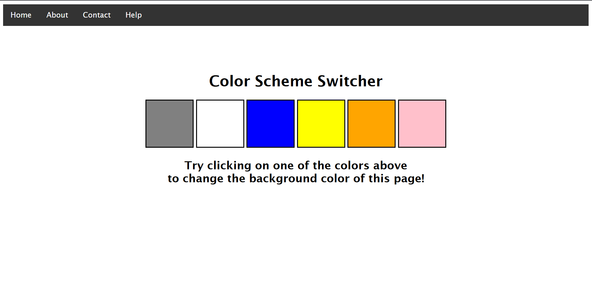

# 🎨 Color Scheme Switcher

This is a simple **Color Scheme Switcher** webpage that allows users to change the background color of the page by clicking on color swatches.

---

## 🖥️ Features

- Clean and minimal UI with a top navigation bar.
- Multiple color swatches to choose from.
- Click on a color block to instantly change the page background color.
- Responsive and easy-to-use layout.

---

## 📂 Project Structure

project-folder/
│
├── index.html # Main HTML file
├── style.css # Stylesheet for page layout and colors
└── script.js # JavaScript file for switching colors dynamically

---

## 🚀 How to Use

1. Clone or download this repository to your local machine.
2. Open the `index.html` file in your browser.
3. Click on any color block displayed on the page.
4. Watch the background color of the page change instantly.

---

## 📝 Technologies Used

- **HTML5** – For the page structure.
- **CSS3** – For styling and color swatches.
- **JavaScript** – For adding interactive color switching functionality.

---

## 📸 Preview

---

## 🔧 Customization

- Add more color blocks by editing the HTML file.
- Change color swatch styles in `style.css`.
- Modify the JavaScript to include gradients or theme switching.
